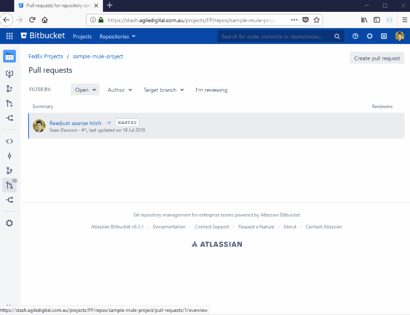

# Mule Preview Browser Extension

## Summary

This project takes the [Mule Preview client](https://github.com/agiledigital/mule-preview)
library and uses it to overlay a visual diff of Mule XML in Bitbucket Server.

It also will show visual previews of Mule XML files.

## How to Use

Simply open a PR in Bitbucket Server and select a Mule XML file.
The Mule Preview button in your browsers toolbar should enable.
Clicking it will toggle Mule Preview mode.

It will also work with single file views.

## Installation

The Chrome and Firefox extensions are built and uploaded to the respective extension stores but are not publicly published yet because of potential licencing issues with packaging Mulesoft assets (see https://github.com/agiledigital/mule-preview-browser-extension/issues/71).

Unfortunately, for now you'll have to build the extension yourself.

Luckily a Makefile is provided to automate the process (see [Setup/Easy Mode](#easy-mode)).

## Compatiblity

This browser extension supports both Firefox and Chrome.

Supports Mule 3.x (Anypoint 6.x) but support for later versions is planned.

Tested on Atlassian Bitbucket (Server) v6.1.1

It does not support any other SCMs at this point (including Bitbucket Cloud) but support is in the works.

Please raise an issue (or a PR!) if there is not already one open to support your favourite web based SCM.

The priority of issues are on the [Mule Preview project kanban](https://github.com/orgs/agiledigital/projects/1)

## Setup

### Easy Mode

There are a few steps that need to be done before you can build the plugin with Webpack
such as extracting the Mule assets from Anypoint Studio. The easiest way to make sure all the dependencies are met
is to use the Makefile.
It will also build the extension so it is ready for use.

Simply run:

    $ make

If you're on Windows you'll need WSL or Git Bash.

After you've run the Makefile once, if you make changes, you can use `npm start` and `npm run build` as normal
since the dependencies will have already been set up.
You can also just run the `make` again as the `make` tool keeps track of what has changed.

### Hard Mode

If you don't want to use the Makefile, you can use the following steps to get everything set up.

Get a copy of [Anypoint Studio 6](https://www.mulesoft.com/lp/dl/studio/previous) and the [mule-metadata-extractor](https://github.com/agiledigital/mule-metadata-extractor):

    $ wget https://mule-studio.s3.amazonaws.com/6.6.1-U1/AnypointStudio-for-linux-64bit-6.6.1-201906072050.tar.gz
    $ wget https://github.com/agiledigital/mule-metadata-extractor/releases/download/v1.0.14/mule-metadata-extractor-1.0.14-standalone.jar
    $ tar -xzf AnypointStudio-for-linux-64bit-6.6.1-201906072050.tar.gz

Extract the metadata to the right directories:

    $ mkdir -p extension/public/img/icons
    $ java -jar mule-metadata-extractor-1.0.14-standalone.jar -d "AnypointStudio" -o extension/public/img/icons extract-images
    $ java -jar mule-metadata-extractor-1.0.14-standalone.jar -d "AnypointStudio" -o extension/public/img/icons apply-light-theme
    $ java -jar mule-metadata-extractor-1.0.14-standalone.jar -d "AnypointStudio" -o extension/public/ generate-mappings

Copy assets from the upstream mule-preview library:

    $ mkdir -p extension/public/css
    $ mkdir -p extension/public/img
    $ rm -f extension/public/css/* extension/public/img/*.{png,svg}
    $ cp -r node_modules/@agiledigital/mule-preview/public/css/ extension/public/
    $ cp node_modules/@agiledigital/mule-preview/public/img/* extension/public/img/

Finally you can use NPM/Webpack to build the output files:

    $ npm run build

## Developing

Make sure that the prerequsites are setup first using the [above Setup section](#Setup).

This command will build the plugin and rebuild if any files change:

    $ npm start

It will also start up [web-ext](https://github.com/mozilla/web-ext) in parallel to hot reload the plugin into Firefox.

## Acknowledgement

Thanks to https://github.com/williankeller/browser-extension-boilerplate for making this extension so easy to get running.

## License

